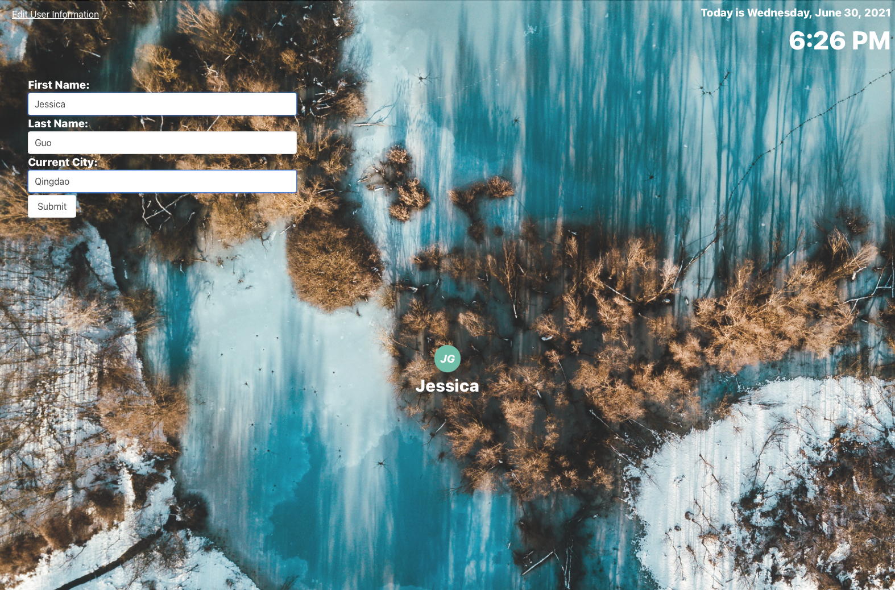

# life-happens

## Deployed Application:

## Description: 

This web app allows user to have a quick glance of his/her day. The interface displays the weather of the day, add any to-do items to complete, the stock market performance as well as the local news.

Feeling Unproductive? Todo list in this application gives you a structure and a plan by allowing the user see the items as "completed items", "all items" and "in progress" items. Also todo-items have delete and check buttons. 

Weather section displays the current weather .Also an input allows the user to search for cities.

## Screenshot

## Credits/Libraries

 Eloquent JavaScript Third Edition / Marijn Haverbeke

 [css.sitepoint.com - Question arrays and more...](https://www.sitepoint.com/simple-javascript-quiz/)

 [stackoverflow.com](https://stackoverflow.com/questions/41703915/how-to-do-local-storage-for-to-do-list)

 [codepen.io](https://codepen.io/ragzor/pen/xGrJrg)

## Technologies
 
    -HTML

    -CSS

    -JavaScript

    -Jquery

    -CSS Bulma

    -CSS FontAwesome

    -API

## Authors

    Megan Ekse: login page, live date and time, personalized display with name and icon.

    Banu Ayozturk: Todo-list with delete button, checked button and select feature.

    Jeff Lynch: Stock market section.

    Kelebet Engida: News section.

    William Kuo: Weather section with an input.Weather section for current weather.

## Contact Us

    For any question about the project, please contact us.

[BanuAyozturk](mailto:bnyksl@gmail.com)

[MeganEkse](mailto:meganekse@gmail.com)

[WilliamKuo](mailto:ywkuo@outlook.com)

[JeffLynch](mailto:)

[KelebetEngida](mailto:engidk@uw.edu)
